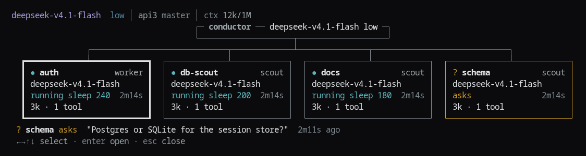

# pi-fugue

Named subagents for [Pi](https://www.npmjs.com/package/@earendil-works/pi-coding-agent), live under the footer.


`↓` on an empty editor:



## Install

```bash
pi install npm:pi-subagents
pi install git:github.com/zqkra/pi-fugue
```

Set `"fleetView": false` in `~/.pi/agent/extensions/subagent/config.json` so only one line shows.

## Use

Ask in plain words:

> launch two riffs with deepseek-v4.1-flash: `auth` (worker) fixes the login, `review` (reviewer) checks it when done

`↓` open · `←→↑↓` move · `enter` details · `esc` close · in details `s` steer, `t` tell, `x` stop

## What it adds

- **Riffs.** Every subagent gets a short name: `riff_spawn`, `riff_tell`, `riff_stop`, `riff_status`.
- **Free chat.** Keep talking to the conductor while riffs work. Results arrive on their own.
- **Durable notices.** A riff that finishes while Pi is closed reports once when you return.
- **Gates.** `fugue_gate` runs the checks in `.pi/fugue.json`.

Custom footers can host the line at the bottom edge by rendering the entries of
`globalThis[Symbol.for("pi.footer-slots.v1")]` (a `Map` of `(width) => string[]`) under their own line.

MIT
